# Morse-Code-Communicator
An Arduino device with it's code for morse-code &lt;-> English translation

There are 2 options:
1. Morse Code to Text
2. Text to Morse Code
The user will have to press the option number through serial input to choose any particular option.

## Option 1
The device contains 3 buttons: dots, dashes, and break. Each of these buttons have corresponding LEDs.
The user enters the morse code for each character. After each character, the break button should be pressed to differentiate it from the next character's morse code. The translated morse code will be displayed on the seven segment display in the following manner:

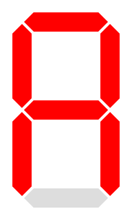
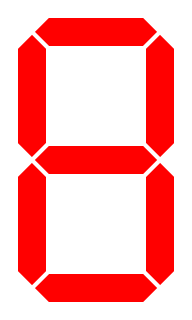

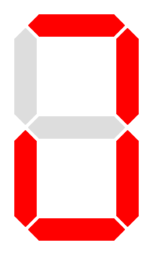
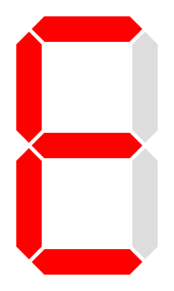

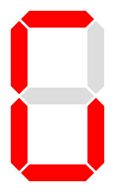

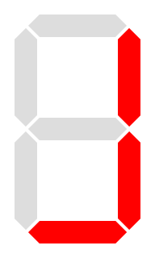
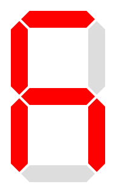
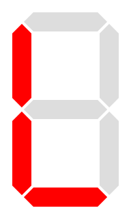
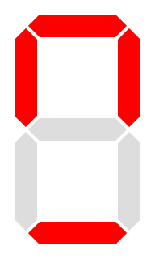
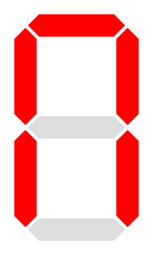
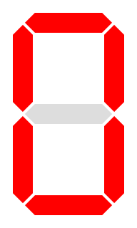
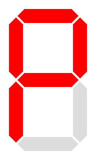

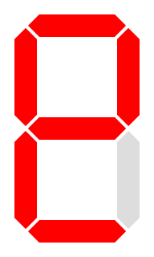
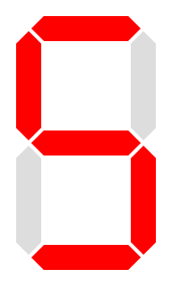

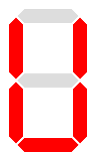
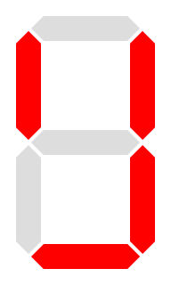

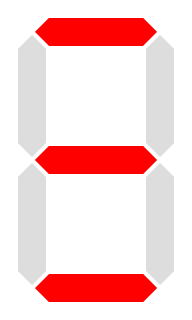

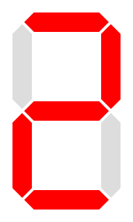

This can be done indefinitely until the break button is pressed twice. This will take the user back to the menu screen.

## Option 2
The user will enter a text string (without spaces) through serial input. The LEDs which corresponded to the INPUT buttons will now act as the output source for the morse code (dot LED, dash LED, and a break LED).
